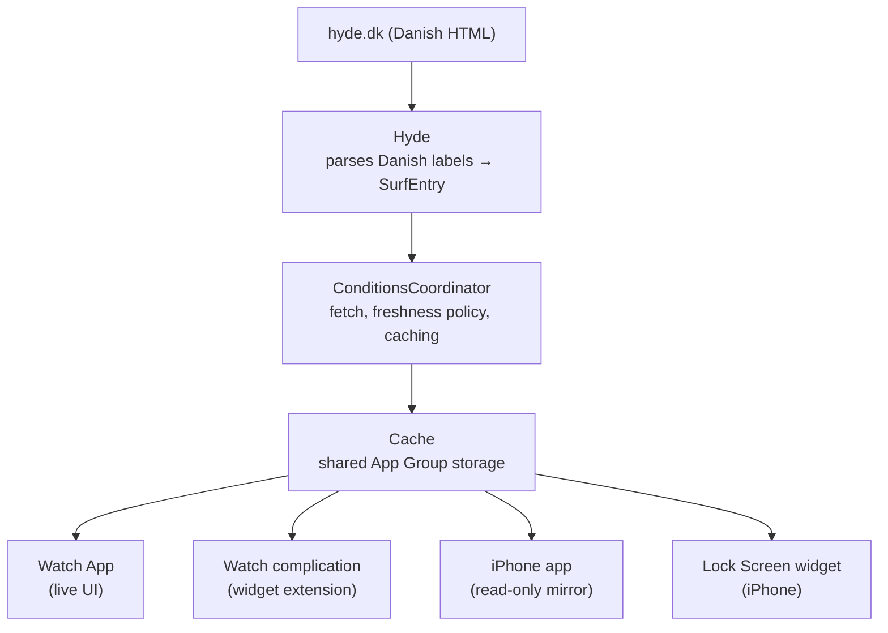

# Patrol 🌊

A glance at your wrist tells you whether it's worth driving to the coast.

Wave height, period, and wind — live from the harbour weather stations along Denmark's North Sea coast 🇩🇰: Hanstholm, Hvide Sande, and Thorsminde. Pick a spot on your watch and it shows on your watch face as a complication. A companion app on your iPhone mirrors the same conditions, with its own Lock Screen widget.

Built for watchOS 26 ⌚️ and iOS 📱

## Architecture

